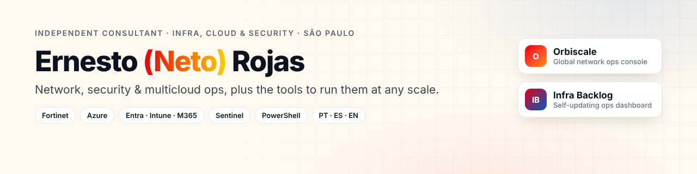

### Hi, I'm Ernesto (Neto) 👋

**Independent Infrastructure, Cloud & Security consultant** in São Paulo, open to roles and projects.
8+ years in IT. In my last engagement I was the infrastructure reference for **9 countries** (Latin America + Canada) in a SOX/GxP-regulated pharma environment.

🔧 **Network & security:** Fortinet (FortiGate HA, FortiSwitch, FortiAP, SSL/IPsec VPN), SonicWall, pfSense
☁️ **Cloud & identity:** Azure (Arc), Entra ID, Active Directory, Conditional Access, AWS, IBM Cloud
🛡️ **Security operations:** Microsoft Sentinel (AMA/DCR), Defender for Cloud Apps, WDAC, SOX access reviews
💻 **Endpoint & collaboration:** Intune, Autopilot, Microsoft 365, Teams Direct Routing (AudioCodes SBC)
🖥️ **Servers:** VMware ESXi, Hyper-V, Citrix, Windows Server, Linux, Veeam, RecoverPoint
⚙️ **Automation & ops:** PowerShell, Microsoft Graph, Python, Bash, Azure DevOps, Git · Zabbix, PRTG, ServiceDesk Plus, ITIL

---

#### 🏅 Certifications

| Vendor | Certification | Year |
|---|---|---|
| IBM | Certified Advanced Architect – Cloud v2 | 2024 |
| IBM | Certified Professional Architect v6 | 2024 |
| IBM | Certified Professional SRE – Cloud v2 | 2024 |
| IBM | Certified Associate SRE – Cloud v2 | 2024 |
| IBM | Certified Professional Developer v6 | 2024 |
| IBM | Cloud for SAP Essentials | 2024 |
| IBM | Certified Technical Advocate – Cloud v4 | 2023 |
| Cisco | CCNA | 2020 |
| Cisco | CyberOps Associate | 2020 |
| Cisco | Network Defense | 2025 |
| Docker | DevOps – Docker | 2023 |

---

#### 📌 Featured projects

| Project | What it shows |
|---|---|
| [**Orbiscale · Network Ops Console**](https://github.com/netorojas/knoc-network-ops-console) · [live demo](https://netorojas.github.io/knoc-network-ops-console/) | One screen for your whole estate, from one country to the world: global map, topology, multicloud discovery (AWS, Azure, GCP, OCI, IBM, VMware, Proxmox, Kubernetes), telephony and layer-by-layer troubleshooting |
| [**Infra Backlog**](https://github.com/netorojas/infra-backlog-dashboard) · [live demo](https://netorojas.github.io/infra-backlog-dashboard/) | A self-updating ops dashboard: e-mail, Teams, Daily notes and the ITSM queue go in; a prioritized, evidence-labelled backlog comes out |

> Fictional company (Contoso Global), no customer data. Both run on localhost (`./serve.sh`) or Docker. Open-core: AGPL-3.0 + commercial licence.

#### 🤝 How I can help
- Fortinet design, hardening and VPN/SD-WAN troubleshooting
- Azure, Entra ID and Intune security baselines
- Onboarding to Microsoft Sentinel (Azure Arc, AMA/DCR, collectors)
- Infrastructure documentation, inventories and PowerShell automation

#### 🧭 How I work
- **Evidence before opinion**: every claim is labelled FACT, PROBABLE or HYPOTHESIS.
- **Read-only first, least privilege always**, with a rollback written before any change.
- **Document and version everything** (Git, Conventional Commits).

#### 🌎 Languages
Portuguese (native) · Spanish (full professional) · English (working, improving)

📫 [LinkedIn](https://www.linkedin.com/in/netorojas/)

<!-- psst: there is a secret in each live demo. Try the arrow keys. -->
